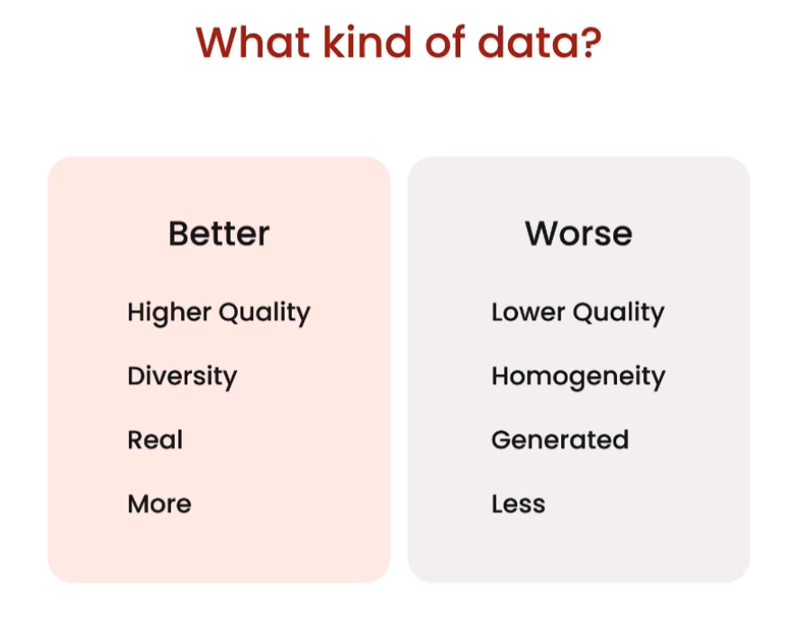
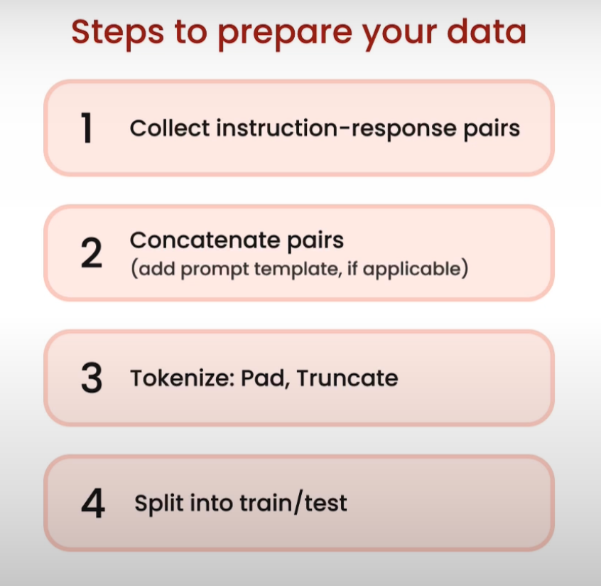
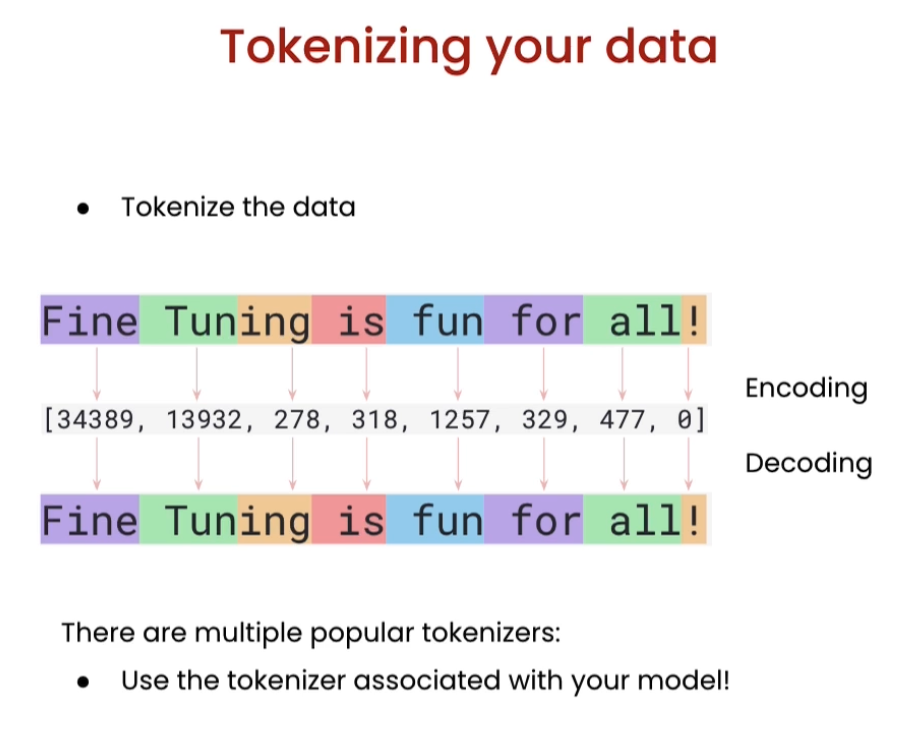

# DATA PREPARATION

- Collect instruction response pairs
- Concatenate pairs if applicable
- Tokenize: Pad, Truncate
- Split into train/test

---

## WHAT KIND OF DATA?

---

## STEPS TO PREPARE

---

## YT RECORDIN

Data Preparation:

---
