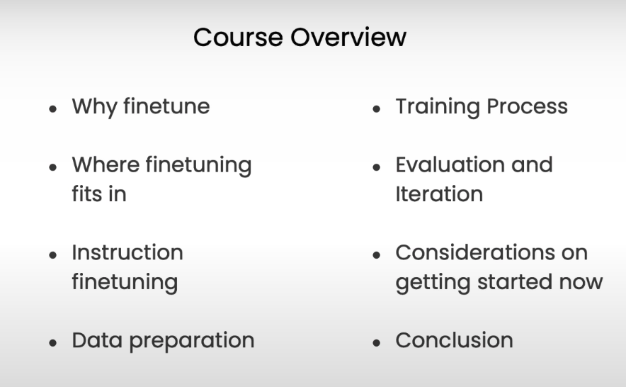

# Finetuning Large Language Models

Learn to finetune an LLM in minutes and specialize it to use your own data

- Master LLM finetuning basics
- Differentiate finetuning from prompt engineering and know when to use each
- Gain hands-on experience with real datasets for your projects

---

## INDEX

1. Why Finetune
2. Where Finetuning fits
3. Instruction Finetuning
4. Data Preparation
5. Training Process
6. Evaluation and Iteration

---

## COURSE LINK

<https://learn.deeplearning.ai/courses/finetuning-large-language-models/>

--
